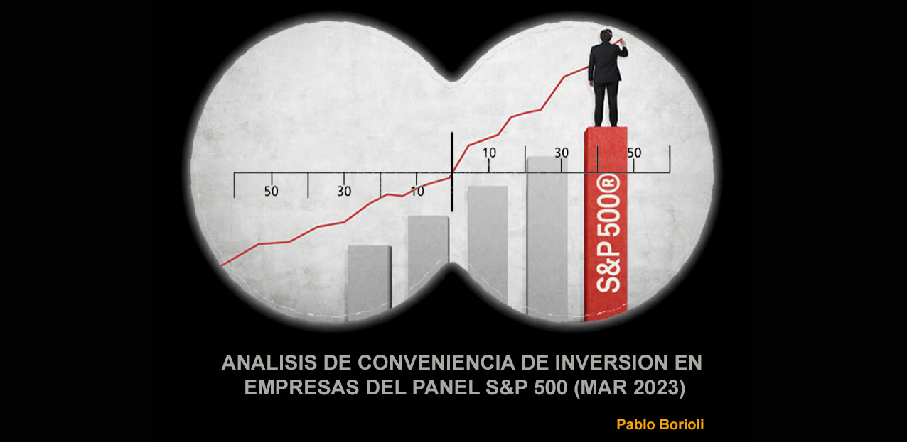

{width=100%}  

  
## `ALCANCE`

Este repositorio contiene un proyecto de Análisis de inversiones en empresas del panel de S&P 500.La finalidad es aconsejar al cliente de acuerdo a sus requerimientos y necesidades respecto de la conveniencia de invertir en empresas/s del panel.  

## `FUENTE DE DATOS`  

Los datos en la mayoría de los casos fueron tomados directamente de Las páginas oficiales de Standard and Poor´s , Yahoo Finance y algunos datos menores de reconocidas empresas que actúan como brockers en el sector financiero de USA.  

## `PROCESAMIENTO DE DATOS` 

Los datos fueron extraidos, debidamente acondicionados y transformados en el archivo jupiter notebook ETA_EDA_S&P500.ipynb donde se generaron las tablas necesarias para hacer un Dashboard de presentación en Power BI (Proyecto S&P500.pbix)

## `REQUERIMIENTOS Y PERFIL DEL CLIENTE`

### Perfil del cliente:
- Dueño de empresa PYME de origen familiar metalúrgica con importante crecimiento en la última década.
- Experiencia en gestión de empresa.
- Amplio conocimiento del mercado local y del rubro.
- Mínimos conocimientos del mercado financiero internacional.
- Interesado en diversificar su cartera de inversiones.
- Primera inversión bursátil en el extranjero.
- Cauto

### Requerimientos básicos:  
- Inversión a corto o mediano plazo (2 años como máximo).  
- Seguridad en la inversión por sobre rentabilidad excesiva.  
- Diversificación  
- Estudio de conveniencia de inversión en empresas que coticen en bolsa de NY (NYSE)

## `OBJETO DE ESTUDIO:`  

S&P 500 es un índice bursátil que toma como referencia a las 500 empresas más importantes de Estados Unidos y es posiblemente el índice más seguido por los inversores de todo el mundo. Sus movimientos repercuten directamente en el mercado bursátil global.Está subdividido en 11 sectores que representan a la totalidad de las empresas del panel.A su vez los sectores se dividen en subsectores para una clasificación más exaustiva de especialización de cada empresa.  
Los once sectores que integran el índice son:  

- *Sector Consumo Discrecional (Consumer Discretionary)*:
Este sector está compuesto por empresas cuya demanda fluctúa dependiendo de la situación económica general. Habitualmente, estas compañías experimentan un crecimiento cuando mejora la economía y el gasto del consumidor acelera.Consumo Discrecional incluye al comercio minorista, proveedores de servicios al consumidor, hoteles, cadenas de restaurantes, fabricantes de automóviles y similares.  
Algunas compañías en este sector son: McDonald’s (MCD), General Motors (GM), Home Depot (HD), Hilton (HLT) o Nike (NKE). Es uno de los sectores más diversos, empresas como Amazon (AMZN) y Netflix (NFLX) también se encuentran aquí, y no en el sector de Tecnología de la Información.  

- *Sector Consumo Básico (Consumer Staples)* : 
Este sector está compuesto por empresas de productos básicos para el consumidor, tales como comida, bebidas y productos de higiene personal. Por lo general, estas compañías forman parte de estrategias defensivas, ya que se asume que mantendrán una parte importante de sus ventas aunque haya un deterioro económico generalizado.Algunas compañías en este sector son: Costco (COST), Procter & Gamble (PG), Kimberly-Clark (KMB) y Coca-Cola (KO).

- *Sector Energía (Energy)*:
Este sector está compuesto por empresas que exploran y explotan hidrocarburos como el petróleo y el gas natural, así como las refinerías que los tratan y otras compañías que les suministran equipamiento. Habitualmente, la evolución de los ingresos de las compañías del sector Energía depende del precio del petróleo y resto de hidrocarburos.Algunas compañías en este sector son: ExxonMobil (XOM) y Chevron (CVX).  

- *Sector Financiero (Financials):*
Este sector está compuesto por bancos comerciales, banca de inversión y compañías aseguradoras. Gran parte de los ingresos del sector Financiero provienen de los intereses recibidos por préstamos e hipotecas. En general, las firmas de este sector crecen cuando suben los tipos de interés.Algunas compañías en este sector son: JPMorgan Chase (JPM), Bank of America (BAC), Berkshire Hathaway (BRK) y CME Group (CME).  

- *Sector Salud (Healthcare)*:
Este sector incluye hospitales, compañías farmacéuticas, de equipamiento médico y empresas de biotecnología. Parte del sector presenta oportunidades con alto riesgo y alto beneficio, como es el caso de la biotecnología. Otra parte, sin embargo, se considera estable y una inversión defensiva en épocas de crisis, ya que muchos productos médicos son imprescindibles.Algunas compañías en este sector son: Pfizer (PFE), UnitedHealth (UNH) y Merck (MRK).  

- *Sector Industrial (Industrials):*
Este sector está compuesto por fabricantes de una amplia variedad de productos. Empresas de defensa, aeroespaciales, aerolíneas, trenes, maquinaria, materiales de construcción… Habitualmente, estas compañías crecen cuando hay una expansión económica y de infraestructuras.Algunas compañías en este sector son: Boeing (BA), Delta Air Lines (DAL), 3M (MMM) y General Electric (GE).  

- *Sector Tecnología de la Información (Technology):*
Este sector incluye fabricantes y distribuidores de hardware, software, semiconductores, equipos de computación y proveedores de servicios tecnológicos.Algunas compañías en este sector son: Apple (AAPL), IBM (IBM), Microsoft (MSFT) y Cisco (CSCO).  

- *Sector Materiales (Materials):*
Este sector está compuesto por empresas químicas, metalúrgicas, de minería y otras relacionadas con el descubrimiento y tratamiento de materias primas.Algunas compañías en este sector son: DuPont (DD), Sherwin-Williams (SHW) y Newmont Corp. (NEM).  

- *Sector Inmobiliario (Real Estate):*
Parte de este sector estaba incluido anteriormente en el sector Financiero. Entre las empresas de este sector existen firmas de inversión inmobiliaria y de gestión y desarrollo de inmuebles comerciales y residenciales.Algunas compañías de este sector son: Simon Property Group (SPG) y Public Storage (PSA). 

- *Sector Servicios de Comunicación (Communication Services):*
Anteriormente, este era el sector Telecomunicaciones y estaba compuesto por compañías telefónicas, proveedores de servicios de Internet y medios de comunicación tradicionales. Desde 2018, el sector se conoce como Servicios de Comunicación e incluye también empresas de medios digitales y redes sociales.Algunas compañías de este sector son: Facebook (FB), Alphabet (GOOG, GOOGL) y AT&T (T).  

- *Sector Servicios Públicos (Utilities):*
Este sector está compuesto por compañías de electricidad, agua, gas y energías renovables.Algunas compañías de este sector son: American Electric Power (AEP), Duke Energy (DUK) y Pacific Gas & Electric (PCG).  

## `ANALISIS DEL PROYECTO`  

Desde un enfoque conceptual, sería correcto decir que para un análisis acertivo  de la conveniencia de inversión en acciones de empresas del indice S&P 500 concurren diversos factores a tener en cuenta.  
Por un lado, es necesario hacer un análisis contextual coyuntural  que incluya la mayor cantidad de factores que pudan repercutir en el desenvolvimiento presente o futuro de los diferentes sectores empresariales, como de las empresas que los componen.Podriamos citar a modo de ejemplo algunos de ellos, como situaciones relevantes  el contexto geopolítico mundial o por regiones, fenómenos naturales significativos y de gran impacto,  condiciones epidemiológicas, así como también situaciones estructurale macroeconómicas como la inflación, el PBI y las tasas de interés.  
Ese análisis contextual debe ser evaluado, ponderado e incluido en el análisis técnico de las variables estadísticas financieras que reflejan el desempeño histórico, el presente y/o las predicciones a futuro, para así poder tener una visión completa de las alternativas de inversión que mejor satisfagan los requisitos del inversor.  

### ANALISIS CONTEXTUAL:  

#### PRINCIPALES HITOS COYUNTURALES A TENER EN CUENTA:  

- Pandemia (2019/2020/2021): Todavía se están viviendo las consecuencias de la crisis global desatada por la Pandemia. Desde el punto de vista económico, la gran liquidez fruto de la enorme emisión monetaria que hicieron todos los paises para poder seguir funcionando en un contexto de una economía totalmente frenada, trajo como consecuencia después del inmediato rebote económico y recuperación de niveles post pandemia, una inflación creciente y muy elevada en todos los mercados.Ello ha impulsado a los bancos centrales a tomar medidas como la suba de la tasa de interés, cuyo caso testigo es la tasa de los bonos soberanos de Estados Unidos que ha llevadola tasa de interés a valores históricos, sólo por debajo de la tasa de interes de la crisis subprime. Lo que trae y va a traer una profundización de la incipiente recesión económica.En este contexto, los bonos de deuda soberana son el espejo del mercado de acciones, y cuando la tasa de interés sube, la seguridad del tipo de inversión más la rentabilidad de la tasa , hace que los inversores hagan el llamado "fly to quality", es decir ir a lo s refugios de seguridad: dólar, oro y bonos de deuda(especialmente de Estados Unidos).

- Guerra Rusia- Ucrania: Una guerra focalizada que toma un tinte globalizado por la magnitud de los actores. Desde el punto de vista económico finaciero, la guerra deja mucho material de análisis.Por un lado, la penalización internacional a Rusia incluye un recorte de la compra del gas barato Ruso que proveía 40 % del gal a toda Europa.Ese gas está siendo reemplazado mayoritariamente por GNL transportado en barcos desde USA a un costo muy superior.Esto deja como grandes ganadores a las empresas del sector energético de USA que están el el rubro del petróleo y gas, y a sus proveedores (Sector Energy de S&P 500).Además la firma de contratos a mediano plazo para la continuidad de la provisión asegura un sector con muy buen rendimiento a futuro.

- Crisis bancaria: La quiebra de algunos bancos importantes en USA y Suiza, más los traspiés de otras entidades como deustche Bank, pusieron incertidumbre en el sector bancario, que ya venía de una muy pobre perfomance durante 2022.

- Síntesis: Todo lo antes mencionado hace que el promedio de las predicciones realizdas por las principales firmas del sector, den un achatamiento del valor con una variacón nula hacia fin de año o tal vez ligeramente negativa en el índice general S&P500.  

### ANALISIS TECNICO-ESTADISTICO: 
Para el análisis puramente técnico podemos ver en el Dashboard en la página "Análisis", las graficas y los principales indicadores que junto al análisis precedente nos van a permitir sacar las conclusiones requeridas.

COMPARACION DE SECTORES DE S&P 500:  
Nos centraremos en el sector izquierdo del Dashboard, que es donde se encuentran los elementos necesarios para este análisis.  
Se puede observar en el gráfico la evolución histórica de la rentabilidad de los cuatro sectores con mejor desempeño durante los últimos tres años.El único sector con tendencia claramente positiva durante ese período completo es en sector Energético, impulsado por el crecimiento del consumo de combustles luego de la regularización de la actividad económica post-pandemia, y mejorando su perfomance con lo ya comentado de la guerra en Ucrania.Los otros sectores que habían mostrado un muy buen desempeño en parte de 2021 , inclusive mejor, tuvieron una brusca caida y cerraron el año 2022 con niveles muy inferiores de rentabilidad.En la tabla de rentabilidad en el año 2022, podemos ver que practicamente el sector de Energía fué el responsable de mantener el indice general de rentabilidad.Siendo la rentabilidad un KPI muy importante para la inversión, sumado a la expectativa de continuo crecimiento del sector basado en precios internacionales del GNL al alza más los contratos garantizados de provisión a Europa, hacen del sector Energético un buen sector donde poner la lupa para revisar los números de sus empresas.
El KPI de rentabilidad se elaboró haciendo la diferencia entre el promedio del valor de cierre de Diciembre 2022 y el mismo promedio de Enero 2022, sobre el promedio de Enero 2022 por cien.   

COMPARACION DE EMPRESAS DEL SECTOR ENERGY DE S&P 500: 

En el sector derecho del Dashboard podemos observar los gráficos , tablas y KPI´s utilizados para la comparación de empresas del sector.
Los KPIs seleccionados para hacer el análisis de las empresas son:  

- MARKET CAP:  
La capitalización de mercado indica el valor total de una empresa en el mercado de valores. Se calcula multiplicando el número total de acciones en circulación de una empresa por el precio actual de mercado por acción.
La capitalización de mercado se utiliza como un indicador del tamaño y la importancia de una empresa en el mercado. Las empresas con una capitalización de mercado alta se consideran generalmente más grandes y más establecidas que las empresas con una capitalización de mercado baja. Por lo tanto, la capitalización de mercado puede ser una medida útil para comparar el valor de una empresa con otras empresas en el mismo sector o en el mercado en general.
En resumen, la capitalización de mercado es un indicador clave que se utiliza para evaluar el tamaño, la importancia y el rendimiento de una empresa en el mercado.Es un indicador de FORTALZA financiera 

- P/E:  
EL Price/Earnings Ratio (P/E Ratio o Ratio Precio/Ganancias en español) es un KPI (Indicador clave de rendimiento, por sus siglas en inglés) comúnmente utilizado para evaluar la valoración de una empresa en el mercado de valores.
El P/E Ratio es una métrica que compara el precio actual de las acciones de una empresa con sus ganancias por acción (Earnings per Share, EPS). Se calcula dividiendo el precio de mercado actual de una acción por el EPS de la empresa.
El P/E Ratio se utiliza a menudo para comparar la valoración de una empresa con sus competidores del mismo sector o con el mercado en general. Un P/E Ratio alto puede indicar que los inversores esperan un crecimiento futuro significativo en las ganancias de la empresa, mientras que un P/E Ratio bajo puede indicar una valoración baja de la empresa.Es una valoración de expectativas de mercado en cuanto al comportamiento futuro de la empresa.Se puede tomar como un indicador de EXPECTATIVAS sobre el desempeño futuro de la empresa.  
   
- Dividend Yield:  
Se trata de un indicador financiero que expresa el porcentaje que representa el dividendo anual de una empresa respecto al precio de su acción en el mercado. Es decir, indica la rentabilidad que se obtiene por invertir en acciones de una empresa a través de los dividendos que ésta paga a sus accionistas.Expresa la RENTABILIDAD de la empresa.  

- KPI 3K3:  
Para determinar las seis empresas más elegibles del sector Energía de S&P 500 de acuerdo a las necesidades del cliente se elaboró un ranking de empresas para cada uno de los KPI´s anteriores y se los combinó ponderando esos KPIs.Una combinación entre FORTALEZA, EXPECTATIVAS y RENTABILIDAD. Acada empresa se la ordenó de acuerdo a su KPI en orden descendente.Al primero de la lista se le asigna un puntaje que es creciente a medida que se aleja de la cima. Luego se suman los puntajes para cada empresa y se elabora un ranking a partir de la empresa que tiene menor puntaje (penalización).

Los indicadores por si solos no son un completo factor de selección por lo que analizaremos esa lista de empresas TOP 6
Se puede observar que  los dos primeros lugares  están  ocupados por las dos  empresas de mayor capitalización del mercado.Eso va de la mano con la cautela en la inversión solicitada por el cliente.Por otro lado hicieron un reparto de dividendos promedio dentro del sector y mantienen expectativas a futuro en linea con el promedio del índice general.
Por otro lado las empresas con menos capitalización, hicieron mejor reparto de dividendos, pero tienen un P/E muy bajo, por lo cuál las expectativas sobre estas empresas es extremadamente baja.Una empresa con bajo P/E podría ser una empresa "undervalued" lo cual no es necesariamente un mal indicador por si sólo.Si la empresa tuviera ingresos constantes y elevados o buenos, podría significar una sustancial mejora en el reparto de dividendos futuro.Suele ser una opción para los inversionistas más osados.Esto último no va en línea conlos requerimientos del cliente de priorizar la seguridad de la inversión.Por otro lado, hay una máxima muy común en los inversionistas, de que es muy arriesgado invertir en empresas con un P/E inferior a 5 porque eso significa problemas potenciales de gestión.
Por todo lo cuál, en función de lo explicado precedentemente, el análisis global nos lleva a quedarnos con las dos primeras empresas del sector.

## `CONCLUSION`  

Comparación Dividend Yield anual o rendimiento por dividendo anual versus tasa anual del Tesoro norteamericano:

La comparación del dividend yield anual de una empresa con la tasa de interés del Tesoro norteamericano puede proporcionar una idea de la rentabilidad de una inversión en acciones en relación con una inversión en bonos. Si el dividend yield anual de una empresa es mayor que la tasa de interés del Tesoro norteamericano, puede indicar que la inversión en acciones puede ser más rentable que la inversión en bonos. 

A pesar de que tanto Chevron como Exxon tienen buenas perspectivas en sus indicadores y dado el contexto que se presenta para su sector en el mediano plazo es positivo a pesar de la posible retracción de la economía a nivel global, el indicador de medida nos muestra que cualquier inversión relativamente segura en el sector estaría por debajo de la tasa de referencia de los bonos del Tesoro Nortamericano, que es una inversión mucho más segura que las acciones bursátiles.Por otro lado, el titular de la FED ha manifestado que la tasa aumentará lo necesario para dominar la inflación, de lo cual se deduce que la estrategia podría ser que la tasa siga creciendo hasta que los niveles de inflación se reduzcan.
Esto hace que gran cantidad de inversores hagan su "fly to quality" y muchos de ellos se refugien en activos seguros, como los mencionados bonos,el dólar o el oro.
Una buena medida y la recomemdada según los requerimientos del cliente para inversiones a corto/mediano plazo sería evaluar invertir en alguno de estos últimos tres activos.

